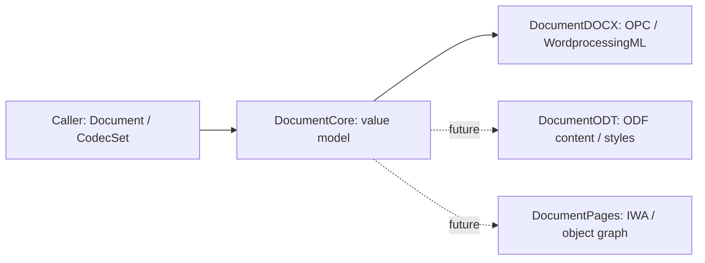

# Word, Writer and Pages: shared design

## Shared semantics

Share document meaning: ordered `Block`s, `Paragraph`s, formatted text and references in `Inline`, physical cells in `Table`, styles, numbering definitions, independent `Story` regions and `Section`s. `DocumentImage` records references and placement. Shared type names do not encode Word-specific XML names.

Measurements use points; color fields retain RGB strings and theme references. `LineSpacingRule` distinguishes multiples from point values. Unresolved format-specific settings remain in `rawProperties` with source parts. Content outside the model remains recoverable through `UnsupportedContent` and warnings.

## Codec boundary

`DocumentCodec` read / inspect / scan share one result contract. `CodecSet` selects linked codecs without Word rules; umbrella convenience APIs use `CodecSet.all`. Core has no Word parser dependency, allowing future ODT-only or Pages-only configurations.

| Concept | Word | LibreOffice Writer | Pages design mapping |
|---|---|---|---|
| Body | document part / body | content.xml / office:text | TSWP storage text and paragraph ranges |
| Formatting | pPr / rPr / basedOn | paragraph / text styles and automatic styles | stylesheet / character / paragraph style archives |
| Tables | tbl / tr / tc, gridSpan / vMerge | table, covered-table-cell | TST TableInfo / TableModel and cell storage |
| Headers | section references to story parts | master page header / footer | storage tied to sections / section templates |
| Images / positioning | DrawingML / VML | draw:frame | drawable objects; distinguish inline attachment from canvas |
| Numbering | abstractNum / num / lvlOverride | list-style and list instances | list styles and paragraph list metadata |

This table records design expectations, not verified ODT / Pages reading support.

## Adding Writer

ODF MIME detection already exists. `DocumentODT` will resolve common / automatic styles in content.xml and styles.xml, then map text, paragraphs and tables and verify list / page-style differences with fixtures. Preserve frame attachment versus free positioning rather than flattening frames into paragraph text. Reading must not require launching Office or converting a document with another app.

## Adding Pages

Pages is not a publicly specified XML format. Interpret Snappy / Protobuf IWA records and object references in a separate internal layer. Current detection checks root type 10000 (TP.DocumentArchive) only; it does not read body meaning. Numbers / Keynote sharing the Index/Document.iwa filename are rejected. Legacy iWork, Index.zip and folder packages are outside detection support.

First verify text, formatting and range boundaries against fixtures; then tables and additional storage regions. Layout documents need an explicit positioned-content model. `UnsupportedContent` is the recovery path until such semantics are implemented.

Sources:

- [ECMA-376](https://ecma-international.org/publications-and-standards/standards/ecma-376/): Word packages, content and compatibility.
- [OASIS ODF 1.3](https://docs.oasis-open.org/office/OpenDocument/v1.3/os/): Writer XML specification.
- [iWorkFileFormat](https://github.com/obriensp/iWorkFileFormat): IWA analysis and Protobuf descriptions.
- [python-pages investigation](https://github.com/isoparametric/python-pages/blob/main/REPORT.md): TP.DocumentArchive and storage analysis.

## Before writing support

Current APIs are read-only. A writer requires a separate preservation contract for relationship IDs, style IDs and opaque parts. Conversions should combine reading warnings and writing losses in one result, following SwiftSheets' approach.
